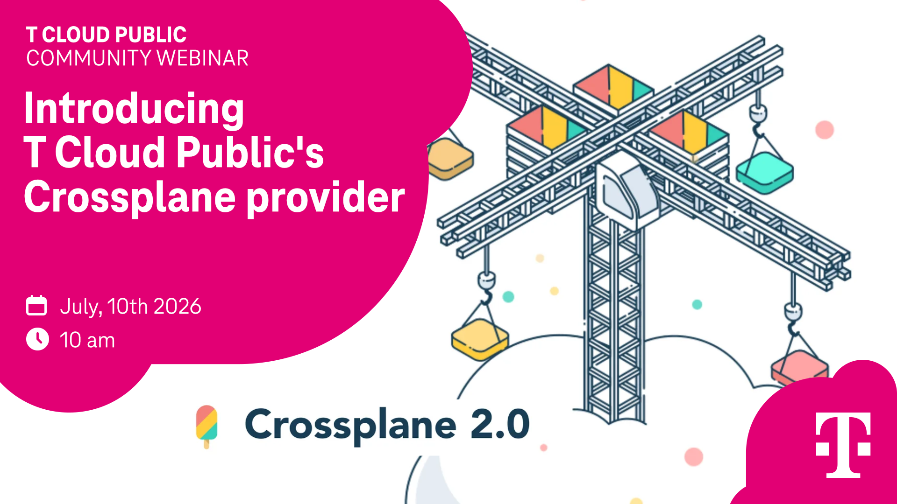
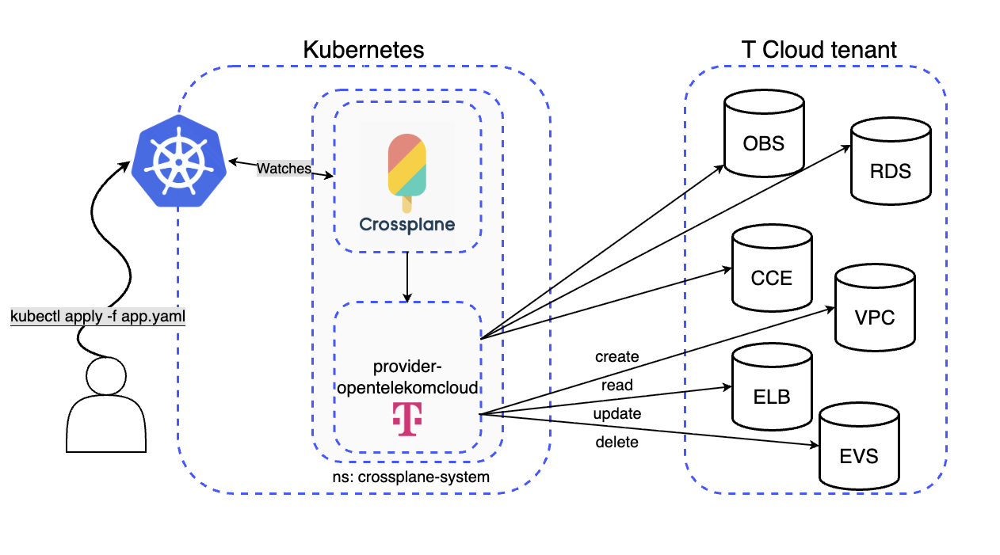
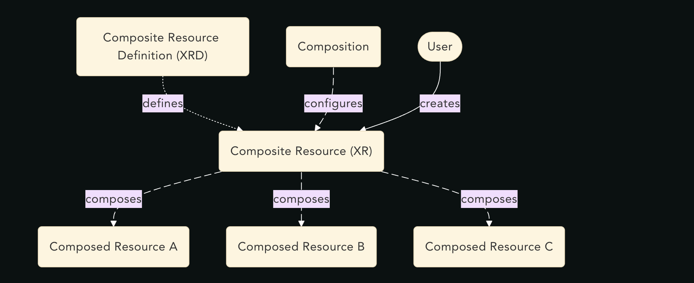

TODOS: links, re-read, re-structure based on feedback
# 🍦 What is Crossplane

[Crossplane](https://docs.crossplane.io/latest/whats-crossplane/) is an open-source control plane that extends Kubernetes to manage cloud infrastructure and services using Kubernetes APIs. It enables platform teams to provision and manage resources across providers such as AWS, Azure, GCP, **T Cloud Public** through declarative, Kubernetes-native configurations.

By turning Kubernetes into a universal control plane for infrastructure, Crossplane allows teams to define reusable platform abstractions and self-service APIs that encapsulate organizational standards, security policies, and operational best practices. Developers consume high-level resources, while Crossplane automatically provisions and manages the underlying cloud infrastructure.

By treating infrastructure as code within Kubernetes and integrating naturally with GitOps workflows, Crossplane helps automate deployments, improve consistency, reduce operational overhead, and simplify cloud operations.

- 💡 Manage cloud services with:
    - ⎈ Kubernetes-style APIs
    - 🕹️ **Reconciliation** loops:
	    - Drives from observed to desired state automatically
    - 💚 **GitOps** tools/workflows:
	    - `helm`
	    - `helmfile`
	    - `argocd`
- ⎈ Installed as a **control-plane/operator** inside a Kubernetes cluster
	- ⚡️ Runs on:
	    - `kind`
	    - `CCE`
	    - `OpenShift`
	    - Any Kubernetes flavor actually
- ☁️ Enables management of **T Cloud Public** services like:
	- `RDS`
	- `OBS`
	- `VPC`
	- `ECS`
	- `CCE`
	- many **more**


## 💡 Let Crossplane automate cloud infra

[T Cloud Crossplane provider](https://github.com/opentelekomcloud/provider-opentelekomcloud) brings cloud resource management into Kubernetes, enabling declarative provisioning and automated reconciliation of services like *RDS*, *CCE*, *OBS*, *ECS*, etc...

When managing cloud resources in Crossplane, there are four key layers working together:

1. **Kubernetes API** – Store resources, validate requests, enforce RBAC, notify controllers.
2. **Crossplane core** – Compositions, functions, dependency management, resource orchestration.
3. **Crossplane Providers** – The cloud/service specific implementations.
4. **ETCD** - Persistent storage of desired and observed state.



# 👀 Terraform vs Crossplane operation  
Crossplane does sound like automated Terraform, what are the differences?

| Aspect                  | Terraform-Based Operations                                            | Crossplane-Based Operations                                               |
| ----------------------- | --------------------------------------------------------------------- | ------------------------------------------------------------------------- |
| **Primary Model**       | Infrastructure as Code using Terraform hcl configurations             | Kubernetes-native infrastructure management using Custom Resources (CRDs) |
| **Control Plane**       | Terraform CLI, Terraform Cloud, or automation pipelines               | Kubernetes acts as the control plane                                      |
| **State Management**    | Requires separate state files (local or remote backend) + state drama | State stored in Kubernetes' etcd                                          |
| **Resource Lifecycle**  | CI/CD pipelines or manual runs                                        | Continuously reconciled by Kubernetes controllers                         |
| **Drift Detection**     | Periodic `terraform plan` required                                    | Automatic and continuous reconciliation                                   |
| **Operational Model**   | Push-based execution                                                  | Pull-based reconciliation                                                 |
| **Multi-Cloud Support** | Mature and extensive                                                  | More limited                                                              |
| **GitOps Integration**  | Indirect, usually through CI/CD runners                               | Native fit with GitOps tools like ArgoCD                                  |
| **Day-2 Operations**    | Changes require Terraform runs                                        | Continuous management and automated remediation                           |
| **Learning Curve**      | Easier for infrastructure teams                                       | "Easier" for Kubernetes-centric platform teams, but can be more complex   |
| **Best Fit**            | Traditional infrastructure automation                                 | IdP, Kubernetes-first organizations                                       |

# ⎈ Crossplane providers

- [Providers](https://docs.crossplane.io/latest/packages/providers/) are responsible for all aspects of connecting to non-Kubernetes resources, like cloud APIs:
    - Define APIs -> [ManagedResource](https://docs.crossplane.io/latest/managed-resources/managed-resources/)
    - Authentication
    - Implement controllers
    - Manage(CRUD) external infrastructure resources
- Most providers are built from **Terraform providers** with upjet

🚀 Example `ManagedResource` to deploy an `OBS` bucket:
```yaml
apiVersion: obs.opentelekomcloud.m.crossplane.io/v1alpha1
kind: Bucket
metadata:
  annotations:
    meta.upbound.io/example-id: obs/v1alpha1/bucket
  labels:
    testing.upbound.io/example-name: b
  name: b
spec:
  forProvider:
    acl: private
    versioning: true
    region: eu-de
    bucket: crossplane-test
    tags:
      Env: Test
      foo: bar
      managed: xplane
```

- `forProvider` section:
    - Similar to Terraform configuration
    - Single [source of truth](https://docs.crossplane.io/latest/managed-resources/managed-resources/#forprovider)
    - **Desired** state definition
    - Protected against deletion by default
## 🕹️ provider-opentelekomcloud

- Provider built using **Upjet tooling**
- Upjet [generates](https://github.com/crossplane/upjet-provider-template) Crossplane providers from Terraform providers
- All Terraform-supported services are configurable
- Some services still lack dynamic value assignment support: [tracker](https://github.com/opentelekomcloud/provider-opentelekomcloud/issues/7)

# 🕹️ManagedResources (MR)

A _managed resource_ (`MR`) represents an external service in a Provider. When users create a new managed resource, the Provider reacts by creating an external resource inside the Provider’s environment.
## Managed resource fields

- The Provider defines the group, kind and version of a managed resource. The Provider also define the available settings of a managed resource.

### Group, Kind and Version

- Each managed resource is a unique API endpoint with their own group, kind and version.
- For example the [T Cloud Provider](LINK) defines the `Bucket` (OBS) kind from the group `obs.opentelekomcloud.m.crossplane.io`

```yaml
apiVersion: obs.opentelekomcloud.m.crossplane.io/v1alpha1
kind: Bucket
```
### forProvider

- The `spec.forProvider` of a managed resource maps to the parameters of the external resource.
- For example, when creating a `Bucket` instance, the Provider supports defining the `region`, `acl`, `versioning` and other fields here.

```yaml
spec:
  forProvider:
    acl: private
    versioning: true
    region: eu-de
    bucket: crossplane-test
```

> [!NOTE]
> `ManagedResources` can be either cluster or namespace scoped. Cluster scoped MRs are legacy resources since v2.0 Crossplane, thus we recommend using Namespace scoped APIs. Staying with OBS example `obs.opentelekomcloud.m.crossplane.io` is a modern namespaced API and `obs.opentelekomcloud.crossplane.io` is legacy Cluster scoped.
# 🛠️ Installing and Configuring the Provider

## Install Crossplane core
Start by creating a namespace for Crossplane:

```bash
kubectl create namespace crossplane-system
```

Next, add the Crossplane Helm repository and update it:

```bash
helm repo add crossplane-stable https://charts.crossplane.io/stable
helm repo update
```

Finally, install Crossplane using Helm:

```bash
helm install crossplane --namespace crossplane-system crossplane-stable/crossplane 
```

After installation, verify that Crossplane is running correctly:

```bash
kubectl -n crossplane-system wait --for=condition=Available deployment --all --timeout=5m
```

## Install the T Cloud Public Provider
```bash
cat <<EOF | kubectl apply -f -
apiVersion: pkg.crossplane.io/v1
kind: Provider
metadata:
  name: provider-opentelekomcloud
spec:
  package: xpkg.upbound.io/opentelekomcloud/provider-opentelekomcloud:v0.9.0
EOF
```

`ClusterProviderConfig` setup with secret:

```bash
cat <<EOF | kubectl apply -f -
apiVersion: v1
kind: Secret
metadata:
  name: provider-secret
  namespace: crossplane-system
type: Opaque
stringData:
  credentials: |
    {
      "user_name": "admin",
      "password": "t0ps3cr3t11",
      "auth_url": "https://iam.eu-de.otc.t-systems.com/v3",
      "domain_name": "OTCxxxxx",
      "tenant_name": "eu-de_project",
      "swauth": "false",
      "allow_reauth": "true",
      "max_retries": "2",
      "max_backoff_retries": "6",
      "backoff_retry_timeout": "60",
      "insecure": "false"
    }
---
apiVersion: opentelekomcloud.m.crossplane.io/v1beta1
kind: ClusterProviderConfig
metadata:
  name: default
spec:
  credentials:
    source: Secret
    secretRef:
      name: provider-secret
      namespace: crossplane-system
      key: credentials
EOF
```

# 🚀 Composite Resources
A composite resource, or XR, represents a set of Kubernetes resources as a single Kubernetes object. Crossplane creates composite resources when users access a custom API, defined in the CompositeResourceDefinition.



- **Multi-cloud engineering** – Enables composing infrastructure APIs that work consistently across multiple cloud providers.
- **Standardized cloud resources** – Allows platform teams to define approved infrastructure patterns, ensuring consistency, security, and compliance across the organization.
- **Self-service infrastructure** – Gives developers simple, application-focused APIs to provision infrastructure without needing deep expertise in cloud platforms.
- **Infrastructure abstraction** – Hides cloud-provider-specific complexity behind higher-level APIs that align with business and platform requirements.
- **Reusable infrastructure patterns** – Packages common architectures (such as databases, Kubernetes clusters, or application environments) into reusable building blocks that can be deployed repeatedly and consistently.

## 🚀 Standardized Database showcase

Imagine a company with multiple development teams, each needing an SQL database for their applications. Using Crossplane, the Platform Engineering team can create guardrails, security policies, and standards that developers must follow. This allows development teams to self-service database provisioning without needing to understand the underlying database infrastructure, cloud APIs or Crossplane.

**Company requirements:**

- PostgreSQL only 
- Backups must be enabled 
- Only approved database flavors can be used
- Maximum database size: 500 GB
- Internal access only
- All resources must be deployed in the same namespace
- Only CLOUDSSD block storage is allowed

The Platform Engineering team creates a custom abstraction API using Crossplane Composite Resources. Development teams can then provision a compliant database using a simple manifest:
```yaml
apiVersion: database.example.org/v1alpha1
kind: DbInstance
metadata:
  name: team-a-db
  namespace: team-a
spec:
  name: team-a-db
  availabilityZone: eu-de-03
  flavor: small
  size: 100
  team: team-a
```

### ⚡️Links for the working example:
[Composite Resource Definition](https://github.com/dombisza/obsidian/blob/master/crossplane-intro/manifests/002_xrd.yaml)
[Composition](https://github.com/dombisza/obsidian/blob/master/crossplane-intro/manifests/003_xr.yaml)
[DbInstance](https://github.com/dombisza/obsidian/blob/master/crossplane-intro/manifests/004_psql.yaml)

## 🧩Multi-cloud Platform Engineering

- Enables [building](https://docs.crossplane.io/latest/composition/) **custom infrastructure APIs**
- No need to write controllers manually

- Use case
    - Team `A` uses **AWS**
    - Team `B` uses **T Cloud**
    
	- ❌ Without Crossplane
	    - Multiple Terraform modules OR one complex module
	    - Developers must understand deployment logic
	- ✅ With Crossplane
	    - Same API for **AWS** and **T Cloud**
		- Platform team abstracts provider complexity
	    - Developers consume simplified, unified APIs

🚀 Example multi-cloud custom API
```yaml
#NOTE not an actual working example
#Implementation dependent

# DEPLOY TO AWS
apiVersion: platform.example.com/v1alpha1
kind: Bucket
metadata:
  name: app-bucket-aws
  namespace: team-a
spec:
  region: us-east-1
  acl: private
  versioning: true
  bucketName: team-a-demo-bucket
  compositionSelector:
    matchLabels:
      provider: aws
---
# DEPLOY TO TCLOUD
apiVersion: platform.example.com/v1alpha1
kind: Bucket
metadata:
  name: app-bucket-tcloud
  namespace: team-b
spec:
  region: eu-de
  acl: private
  versioning: true
  bucketName: team-b-demo-bucket
  compositionSelector:
    matchLabels:
      provider: tcloud
```
[# Managing Resources Across Multiple Cloud Providers with Crossplane](https://oneuptime.com/blog/post/2026-02-09-crossplane-multiple-clouds/view)

