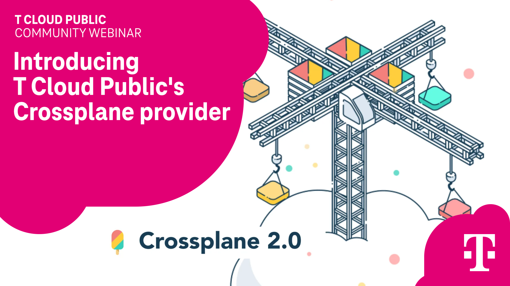
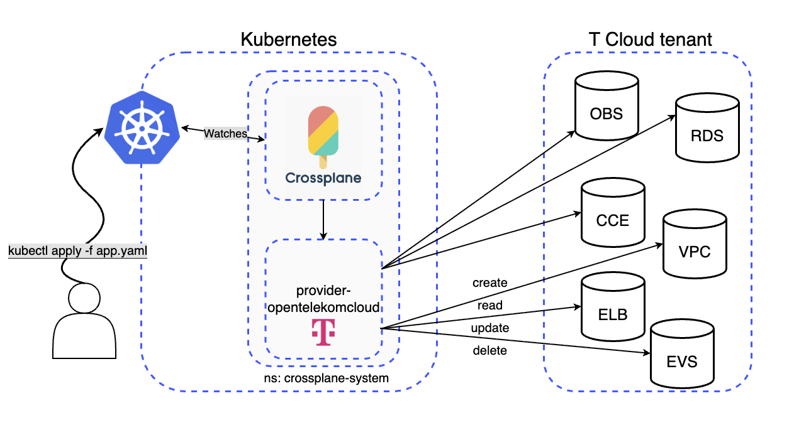
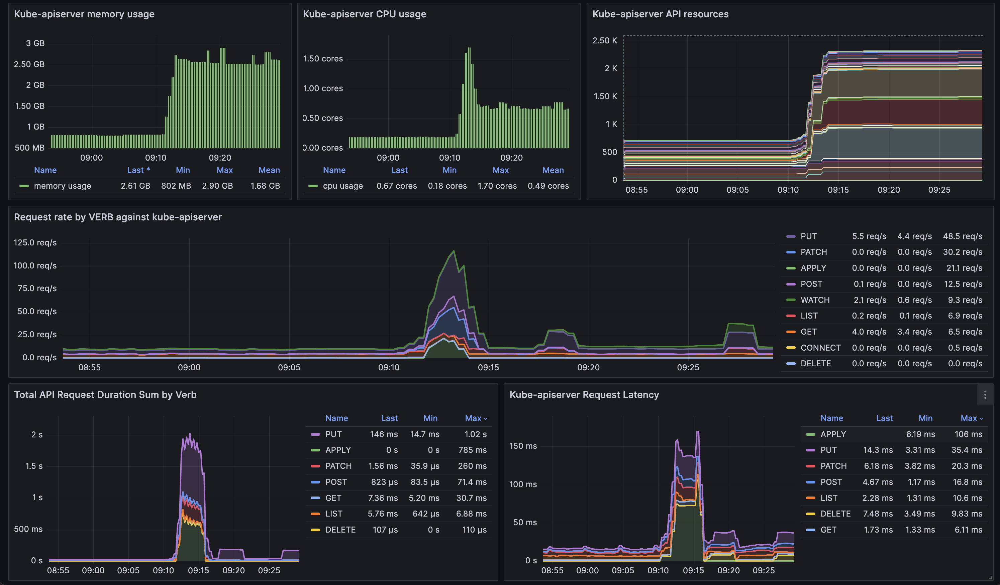
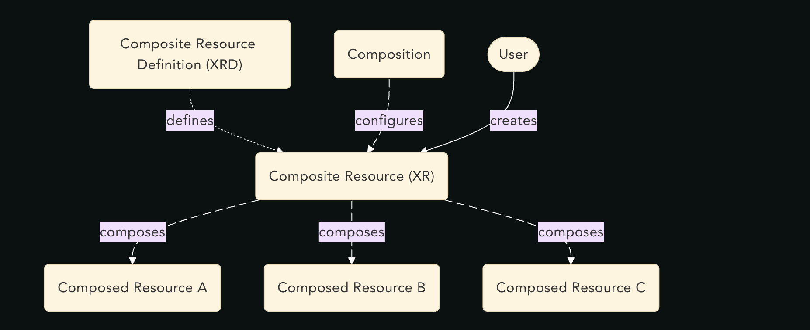

# 🍦 What is Crossplane

[Crossplane](https://docs.crossplane.io/latest/whats-crossplane/) is an open-source control plane that extends Kubernetes to manage cloud infrastructure and services using Kubernetes. It enables platform teams to provision and manage resources across providers such as AWS, Azure, GCP, **T Cloud Public** through declarative, Kubernetes-native configurations.

By turning Kubernetes into a universal control plane for infrastructure, Crossplane allows teams to define reusable platform abstractions and self-service APIs that encapsulate organizational standards, security policies, and operational best practices. Developers consume high-level resources, while Crossplane automatically provisions and manages the underlying cloud infrastructure.

By treating infrastructure as code within Kubernetes and integrating naturally with GitOps workflows, Crossplane helps automate deployments, improve consistency, reduce operational overhead, and simplify cloud operations.

- 💡 Manage cloud services with:
    - ⎈ Kubernetes-style APIs
    - 🕹️ **Reconciliation** loops:
	    - Drives from observed to desired state automatically
    - 💚 **GitOps** tools/workflows:
	    - `helm`
	    - `helmfile`
	    - `argocd`
- ⎈ Installed as a **control-plane/operator** inside a Kubernetes cluster
	- ⚡️ Runs on:
	    - `kind`
	    - `CCE`
	    - `OpenShift`
	    - Any Kubernetes flavor actually
- ☁️ Enables management of **T Cloud Public** services like:
	- `RDS`
	- `OBS`
	- `VPC`
	- `ECS`
	- `CCE`
	- many **more**


## 💡 Crossplane architecture

[T Cloud Crossplane provider](https://github.com/opentelekomcloud/provider-opentelekomcloud) brings our cloud resource management into Kubernetes, enabling declarative provisioning and automated reconciliation of services like *RDS*, *CCE*, *OBS*, *ECS*, etc...

When managing cloud resources in Crossplane, there are four key components working together:

1. **Kubernetes API** – Store resources, validate requests, enforce RBAC, notify controllers.
2. **Crossplane core** – Compositions, packages, functions, dependency management, resource orchestration.
3. **Crossplane Providers** – The cloud/service specific implementations(APIs + controllers).
4. **ETCD** - Persistent storage of desired and observed state.

When you apply a ManagedResource manifest, the Crossplane Provider reconciles the desired state in Kubernetes with the actual state in the cloud provider's API, creating, updating, or deleting the external resource as needed.


# 👀 Terraform vs Crossplane operation  
Crossplane does sound like automated Terraform, what are the differences?

| Aspect                  | Terraform-Based Operations                                            | Crossplane-Based Operations                                               |
| ----------------------- | --------------------------------------------------------------------- | ------------------------------------------------------------------------- |
| **Primary Model**       | Infrastructure as Code using Terraform hcl configurations             | Kubernetes-native infrastructure management using Custom Resources (CRDs) |
| **Control Plane**       | Terraform CLI, Terraform Cloud, or automation pipelines               | Kubernetes acts as the control plane                                      |
| **State Management**    | Requires separate state files (local or remote backend) + state drama | State stored in Kubernetes' etcd                                          |
| **Resource Lifecycle**  | CI/CD pipelines or manual runs                                        | Continuously reconciled by Kubernetes controllers                         |
| **Drift Detection**     | Periodic `terraform plan` required                                    | Automatic and continuous reconciliation                                   |
| **Operational Model**   | Push-based execution                                                  | Pull-based reconciliation                                                 |
| **Multi-Cloud Support** | Mature and extensive                                                  | Limited, but catching up                                                  |
| **GitOps Integration**  | Indirect, usually through CI/CD runners                               | Native fit with GitOps tools like ArgoCD                                  |
| **Learning Curve**      | Easier for infrastructure teams                                       | "Easier" for Kubernetes-centric platform teams, but can be more complex   |


# ⎈ Crossplane providers

- [Providers](https://docs.crossplane.io/latest/packages/providers/) are responsible for all aspects of connecting to non-Kubernetes resources:
    - Define cloud APIs as Kubernetes CRDs
    - Handle Authentication
    - Implement controllers
    - Manage external infrastructure resources
- Most providers are built from **Terraform providers** with [upjet](https://github.com/crossplane/upjet) 

🚀 Example `ManagedResource` to deploy an `OBS` bucket:
```yaml
apiVersion: obs.opentelekomcloud.m.crossplane.io/v1alpha1
kind: Bucket
metadata:
  annotations:
    meta.upbound.io/example-id: obs/v1alpha1/bucket
  labels:
    testing.upbound.io/example-name: b
  name: b
spec:
  forProvider:
    acl: private
    versioning: true
    region: eu-de
    bucket: crossplane-test
    tags:
      Env: Test
      foo: bar
      managed: xplane
```

- `forProvider` section:
    - Single [source of truth](https://docs.crossplane.io/latest/managed-resources/managed-resources/#forprovider)
    - **Desired** state definition
## 🦾 provider-opentelekomcloud

- Provider built using **Upjet tooling**
- Upjet [generates](https://github.com/crossplane/upjet-provider-template) Crossplane providers from Terraform providers
- All Terraform-supported services are configurable
- Some services still lack dynamic value assignment support: [tracker](https://github.com/opentelekomcloud/provider-opentelekomcloud/issues/7)

> [!NOTE]
> The provider ships hundreds of new APIs and controllers by default, which will increase the load on `kube-apiserver` and `etcd`. Please consider using [ManagedResourceActivationPolicies](https://docs.crossplane.io/latest/managed-resources/managed-resource-activation-policies/) to only activate needed resources.


# 🛠️ Installing and Configuring the Provider

## 🍦 Install Crossplane core

Start by creating a namespace for Crossplane:
```bash
kubectl create namespace crossplane-system
```

Next, add the Crossplane Helm repository and update it:
```bash
helm repo add crossplane-stable https://charts.crossplane.io/stable
helm repo update
```

Finally, install Crossplane using Helm:
```bash
helm install crossplane crossplane-stable/crossplane \
  --set provider.defaultActivations={"*.opentelekomcloud.m.crossplane.io"} \
-n crossplane-system
```

After installation, verify that Crossplane is running correctly:
```bash
kubectl -n crossplane-system wait --for=condition=Available deployment --all --timeout=5m
```

## 🕹️ Install the T Cloud Public Provider
`Provider` kind is a CRD installed and managed by Crossplane as a [package](https://docs.crossplane.io/latest/packages/) . 
```yaml
cat <<EOF | kubectl apply -f -
apiVersion: pkg.crossplane.io/v1
kind: Provider
metadata:
  name: provider-opentelekomcloud
spec:
  package: xpkg.upbound.io/opentelekomcloud/provider-opentelekomcloud:v0.9.0
EOF
```

Set up AUTH with `ClusterProviderConfig`:
```shell
export CROSSPLANE_CLOUD_CREDENTIALS='{"user_name":"USERNAME","access_key":"MY_AK", "secret_key":"MY_SK","auth_url":"https://iam.eu-de.otc.t-systems.com/v3","domain_name":"MYDOMAIN","tenant_name":"eu-de_PROJECT","swauth":"false","allow_reauth":"true","max_retries":"2","max_backoff_retries":"6","backoff_retry_timeout":"60","insecure":"false"}'
```

```shell
kubectl -n crossplane-system create secret generic provider-secret --from-literal=credentials="${CROSSPLANE_CLOUD_CREDENTIALS}" --dry-run=client -o yaml | kubectl apply -f -
```

`ClusterProviderConfig` kind is installed and managed by the T Cloud provider. You might need to wait 1-2 minutes while the Provider starts all controllers.
```yaml
cat <<EOF | kubectl apply -f -
apiVersion: opentelekomcloud.m.crossplane.io/v1beta1
kind: ClusterProviderConfig
metadata:
  name: default
spec:
  credentials:
    source: Secret
    secretRef:
      name: provider-secret
      namespace: crossplane-system
      key: credentials
EOF
```

Deploy a `Bucket` as a test:
```yaml
cat <<EOF | kubectl apply -f -
apiVersion: obs.opentelekomcloud.m.crossplane.io/v1alpha1
kind: Bucket
metadata:
  labels:
    testing.upbound.io/example-name: b
  name: b
spec:
  forProvider:
    acl: private
    versioning: true
    region: eu-de
    bucket: my-crossplane-test-1
    tags:
      Env: Test
      foo: bar
      managed: xplane
EOF
```
# 🕹️ManagedResources (MR)

A _managedResource_ (`MR`) represents an external service in a Provider. When users create a new managed resource, the Provider reacts by creating an external resource inside the Provider’s environment.
## 🎚️ Managed resource fields

- The Provider defines the `group`, `kind` and `version` of a managed resource. The Provider also define the available settings of a managed resource.

### Group, Kind and Version

- Each managed resource is a unique API endpoint with their own `group`, `kind` and `version`.
- For example the [T Cloud Provider](LINK) defines the `Bucket` (OBS) kind from the group `obs.opentelekomcloud.m.crossplane.io`

```yaml
apiVersion: obs.opentelekomcloud.m.crossplane.io/v1alpha1
kind: Bucket
```
### forProvider

- The `spec.forProvider` of a managed resource maps to the parameters of the external resource.
- For example, when creating a `Bucket` instance, the Provider supports defining the `region`, `acl`, `versioning` and [other](https://marketplace.upbound.io/providers/opentelekomcloud/provider-opentelekomcloud/v0.9.0/resources/obs.opentelekomcloud.m.crossplane.io/Bucket/v1alpha1#doc:spec) fields here.

```yaml
spec:
  forProvider:
    acl: private
    versioning: true
    region: eu-de
    bucket: crossplane-test
```

> [!NOTE]
> `ManagedResources` can be either cluster or namespace scoped. Cluster scoped MRs are legacy resources since v2.0 Crossplane, thus we recommend using Namespace scoped APIs. Staying with OBS example `obs.opentelekomcloud.m.crossplane.io` is a modern namespaced API and `obs.opentelekomcloud.crossplane.io` is legacy Cluster scoped.

## ⚙️ Automatic reconciliation
Crossplane and Providers continuously reconciling to the desired state defined in Kubernetes. The Provider watches the `ManagedResource` state in the cloud API and compares it's state with the desired configuration. If a resource is modified outside of Crossplane , the Provider automatically detects and corrects this drift unless configured otherwise. By default the reconciliation loop runs every 10 minutes, but it is configurable with [DeploymentRuntimeConfig](https://github.com/opentelekomcloud/provider-opentelekomcloud/blob/main/docs/configure-the-provider.md), but be aware of API rate limits.

### 🚨 Deletion protection
By default, the provider protects resources from accidental deletion or re-creation. External resources are deleted only when the Kubernetes resource is intentionally removed.

```
### example changing the AZ field for and RDS instance which would lead to re-creation:
  Conditions:
    Last Transition Time:  2026-06-26T11:00:54Z
    Message:               observe failed: cannot run plan: plan failed: Instance cannot be destroyed: Resource opentelekomcloud_rds_instance_v3.team-a-db-f4948320f209 has lifecycle.prevent_destroy set, but the plan calls for this resource to be destroyed. To avoid this error and continue with the plan, either disable lifecycle.prevent_destroy or reduce the scope of the plan using the -target flag.
```

# 🚀 Composite Resources (XR)
A composite resource, or XR, represents a set of Kubernetes resources as a single Kubernetes object. Crossplane creates composite resources when users access a custom API, defined in the CompositeResourceDefinition(XRD).

- Composite resource definitions (`XRDs`) define the schema for a custom API.
- Compositions are a template for creating multiple Kubernetes resources as a single _composite_ resource.



## 👍 Compositions can enable:

- **Multi-cloud engineering** – Enables composing infrastructure APIs that work consistently across multiple cloud providers.
- **Standardized cloud resources** – Allows platform teams to define approved infrastructure patterns, ensuring consistency, security, and compliance across the organization.
- **Self-service infrastructure** – Gives developers simple, application-focused APIs to provision infrastructure without needing deep expertise in cloud platforms.
- **Infrastructure abstraction** – Hides cloud-provider-specific complexity behind higher-level APIs that align with business and platform requirements.
- **Reusable infrastructure patterns** – Packages common architectures (such as databases, Kubernetes clusters, or application environments) into reusable building blocks that can be deployed repeatedly and consistently.

## 🏗️ Standardized Database showcase

Imagine a company with multiple development teams, each needing an SQL database for their applications. Using Crossplane, the Platform Engineering team can create guardrails, security policies, and standards that developers must follow. This allows development teams to self-service database provisioning without needing to understand the underlying database infrastructure, cloud APIs or Crossplane.

**Company requirements:**

- PostgreSQL only 
- Backups must be enabled 
- Only approved database flavors can be used
- Maximum database size: 500 GB
- Internal access only
- All resources must be deployed in the same namespace
- Only CLOUDSSD block storage is allowed

The Platform Engineering team creates a custom abstraction API using Crossplane Composite Resources. Development teams can then provision a compliant database using a simple manifest:
```yaml
apiVersion: database.example.org/v1alpha1
kind: DbInstance
metadata:
  name: team-a-db
  namespace: team-a
spec:
  name: team-a-db
  availabilityZone: eu-de-03
  flavor: small
  size: 100
  team: team-a
```

### ⚡️Links for the working example:
[Function](https://github.com/dombisza/obsidian/blob/master/crossplane-intro/manifests/xr/001_function.yaml)
[Composite Resource Definition](https://github.com/dombisza/obsidian/blob/master/crossplane-intro/manifests/xr/002_xrd.yaml)
[Composition](https://github.com/dombisza/obsidian/blob/master/crossplane-intro/manifests/xr/003_xr.yaml)
[DbInstance](https://github.com/dombisza/obsidian/blob/master/crossplane-intro/manifests/xr/004_psql.yaml)

## 🧩Multi-cloud Platform Engineering

- Enables [building](https://docs.crossplane.io/latest/composition/) **custom infrastructure APIs**
- No need to write controllers manually

- Use case
    - Team `A` uses **AWS**
    - Team `B` uses **T Cloud**
    
	- ❌ Without Crossplane
	    - Multiple Terraform modules OR one complex module
	    - Developers must understand deployment logic
	- ✅ With Crossplane
	    - Same API for **AWS** and **T Cloud**
		- Platform team abstracts provider complexity
	    - Developers consume simplified, unified APIs

🚀 Example multi-cloud custom API
```yaml
#NOTE not an actual working example
#Implementation dependent

# DEPLOY TO AWS
apiVersion: platform.example.com/v1alpha1
kind: Bucket
metadata:
  name: app-bucket-aws
  namespace: team-a
spec:
  region: us-east-1
  acl: private
  versioning: true
  bucketName: team-a-demo-bucket
  compositionSelector:
    matchLabels:
      provider: aws
---
# DEPLOY TO TCLOUD
apiVersion: platform.example.com/v1alpha1
kind: Bucket
metadata:
  name: app-bucket-tcloud
  namespace: team-b
spec:
  region: eu-de
  acl: private
  versioning: true
  bucketName: team-b-demo-bucket
  compositionSelector:
    matchLabels:
      provider: tcloud
```
[# Managing Resources Across Multiple Cloud Providers with Crossplane](https://oneuptime.com/blog/post/2026-02-09-crossplane-multiple-clouds/view)

# 🤷‍♂️ Where to find out more about the Provider and Crossplane

- Official Crossplane [docs](https://docs.crossplane.io/latest/) is a good place to start
- Our Github has a [quick start guide](https://github.com/opentelekomcloud/provider-opentelekomcloud/tree/main#getting-started) for the Provider's deployment
- Understanding [ProviderConfig](https://docs.crossplane.io/latest/packages/providers/#provider-configuration) types 
- Configuration, upgrade and import [docs](https://github.com/opentelekomcloud/provider-opentelekomcloud/tree/main/docs) 
- CRDs are self documenting, but [Upbound's](https://marketplace.upbound.io/providers/opentelekomcloud/provider-opentelekomcloud/v0.9.0?tab=managedResources) page might be friendlier
- If you are having issues you can request help in [Github](https://github.com/opentelekomcloud/provider-opentelekomcloud/issues)